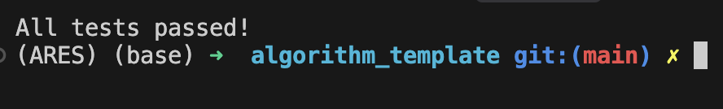
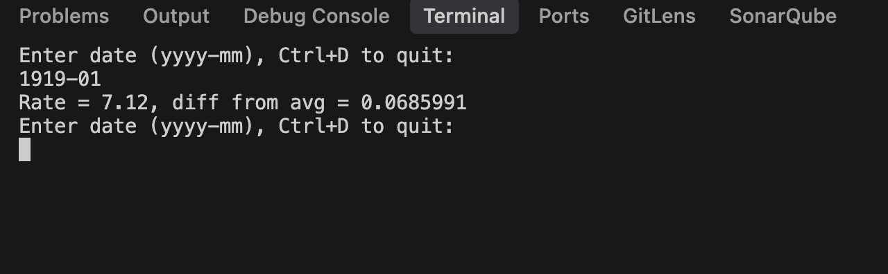

# Homework 1

# Problem

Read the data from the file and calculate the average of the rate.
Also, find the rate by date which is input by the user.

# Code Components

## util.cpp

This file contains the implementation of the average and find_rate functions.

## util.hpp

This file contains the declaration of the average and find_rate functions.

## main.cpp

This file contains the main function. In the main function, it will read the data from the file and calculate the average of the rate.
Also, find the rate by date which is input by the user.
Press Ctrl+D to quit.

## unit_test/unit_test.cpp

This file contains the unit test for the average and find_rate functions.
And the test cases are in this file too.

## Screenshot

### Unit Test

The unit test is passed.

### Main

The main function is working. That user can input the date and get the rate.
