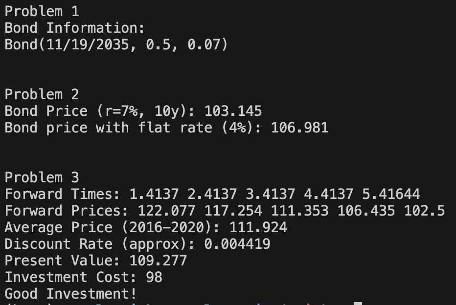

# Homework 2

# Problem

Read bond data from file and calculate forward prices based on given zero rates.
Simulate multiple scenarios and compute the average forward price.
Also, provide functions for bond pricing and testing.

# Code Components

## bond.cpp

This file contains the implementation of the `Bond` class functions, including bond pricing and forward price calculation.

## bond.hpp

This file contains the declaration of the `Bond` class and its member functions.

## main.cpp

This file contains the main function. It reads the bond data, calls the bond pricing functions, and outputs the results.

## unit_test/unit_test.cpp

This file contains the unit test for the bond pricing and forward price functions.
Test cases are also included here.

## Bond_Ex3.csv

This file contains sample bond data for testing the program.

## Bond.xlsx

This file contains bond-related calculations in Excel format.

## Homework 2 Rubric.xlsx

This file contains the rubric for grading Homework 2.

## Makefile

This file contains compilation instructions for building the project.

# Screenshot

### Unit Test

The unit test is passed.

### Main

The main function works correctly, reading the CSV data and calculating forward prices.

