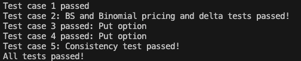
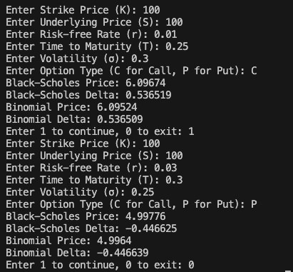

## Homework 3 - Option Pricing Project
- Name: Francis Lin
- GT ID: 904025249

## Overview
This project implements option pricing using both the **Black-Scholes-Merton (BSM)** model and the **Binomial Lattice Method** for European options (Call and Put). The project follows object-oriented principles in C++ and contains classes to handle option parameters, pricing models, and the computation of the Greek Delta.

## Files

### 1. `Option.h` & `Option.cpp`
These files define and implement the `Option` class, which encapsulates the basic properties of an option, such as:
- Strike price (K)
- Underlying asset price (S)
- Risk-free rate (r)
- Time to maturity (T)
- Volatility (sigma)

The class provides constructors to initialize these parameters and getter functions to access them.

### 2. `Pricing_Method.h`
This file defines an abstract class `Pricing_Method`, which declares two pure virtual functions:
- `BSM_Pricer()`: To be implemented for pricing options using the Black-Scholes model.
- `Binomial_Pricer()`: To be implemented for pricing options using the binomial lattice method.

The class serves as an interface for deriving option pricing methods.

### 3. `Option_Price.h` & `Option_Price.cpp`
These files define and implement the `Option_Price` class, which inherits from both `Option` and `Pricing_Method`. The class provides implementations for:
- `BSM_Pricer()` and `BSM_Delta()`: Using the Black-Scholes formula to calculate the option price and its Delta.
- `Binomial_Pricer()` and `Binomial_Delta()`: Using the Binomial Lattice Method to calculate the option price and its Delta.

The class is designed to handle both Call and Put options.

### 4. `main.cpp`
This file serves as the main entry point of the program. It prompts the user to input option parameters (such as strike price, underlying price, risk-free rate, etc.) and the option type (Call or Put). It calculates and displays the option price and Delta using both the Black-Scholes model and the Binomial Lattice Method.

### 5. `\unit_test\unit_test.cpp`
This file contains unit tests to verify the correctness of the `Option_Price` class. It tests both Call and Put options, ensuring that the Black-Scholes and Binomial methods provide consistent pricing and Delta results within a specified tolerance. If all tests pass, it outputs a success message.

### Screenshot

#### Unit Test

The unit test is passed.

#### Main

The main function works correctly, users can infinitely input the option parameters and get the pricing and delta results.

